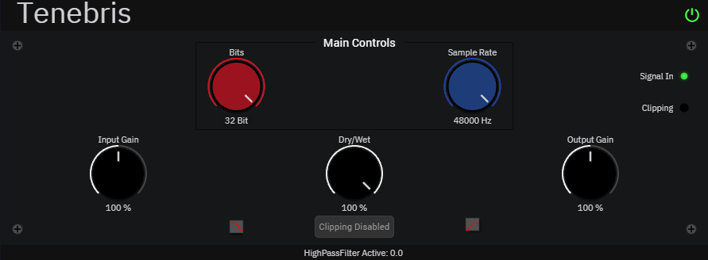

<h1 align="center">Welcome to Tenebris 👋</h1>
<p>
  
</p>

> Sample-rate and Bit rate reducer

</img>

## Author
[](https://app.fossa.com/projects/git%2Bgithub.com%2FRAR-AUDIO%2FTenebris?ref=badge_shield)


👤 **RAR-AUDIO**

#

## User Manual

### System Requirements
```
Windows 8 or later (64-bit)
Dual-Core Intel or AMD Processor (Quad-Core Recommended)
4GB RAM

Plugin format: VST3
```


### Tenebris Parameters

```
Input Gain: The input gain parameter dictates how much volume or gain comes into the unit.

Bits: The Bits parameter sets how much or less the unit is going to reduce bits (16 CD quality)

Dry/Wet: The Dry/Wet parameter handles how much of the effect is going to be rendered.

Sample Rate: The sample rate parameter dictates how much or less the unit is going to reduce in samples (sample rate is tied with your engine sample rate.)

Output Gain: The output gain parameter dictates how much volume or gain comes out of the unit.

Clipping
```

### Installation
#### Windows
```
Double-Click on the INSTALLER icon and follow the on-screen prompts. 
You may choose to customize your installation by selecting those VST3 plug-in format listed.
Choose the desired plug-in directory paths (those default are usually noted best), and proceed
```


***

## Show your support

Give a ⭐️ if you liked this project.


## License
[](https://app.fossa.com/projects/git%2Bgithub.com%2FRAR-AUDIO%2FTenebris?ref=badge_large)